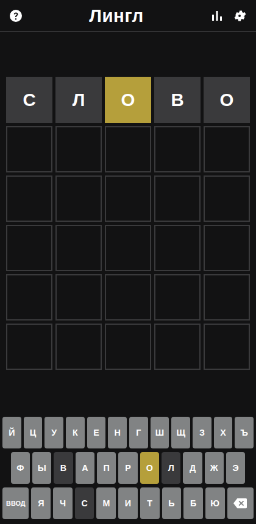
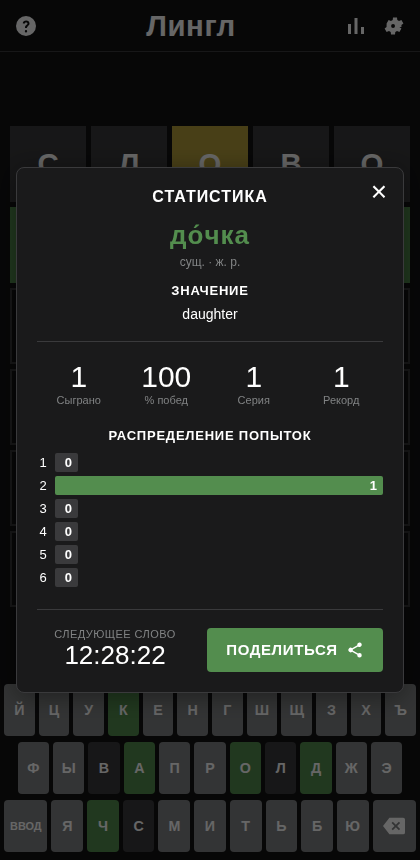
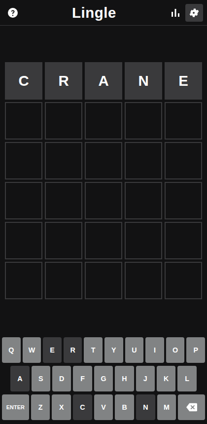

# Lingle

A self-hosted word guessing game in the style of Wordle, with a language
selector. One puzzle per language per day.s

<p align="center">
  
  
  
</p>

## What it does

- **Russian and English** out of the box, switchable from the settings menu
  without a reload. Adding a language is one JSON file.
- **It tells you what the word meant.** When the puzzle ends you get the
  dictionary entry: for Russian, the English meaning, the grammatical gender and
  the stressed spelling (`до́чка`, not `дочка`) — which is the bit that makes
  this useful for a language you are still learning. 85% of Russian answers and
  94% of English ones have an entry; the rest just show the word.
- **A real Russian word list** — 40,056 accepted guesses drawn from the
  OpenCorpora dictionary, and 1,309 answers filtered down to nouns in the
  nominative singular and ranked by how common they actually are. `ё` is folded
  onto `е` everywhere, so nobody has to hunt for the key.
- **Daily puzzle**, derived from the date. Everyone gets the same word, and the
  sequence is a fixed shuffle so no word repeats for 3.6 years (Russian) or 5.9
  years (English).
- Hard mode, colour-blind palette, light and dark themes, emoji share grid,
  per-language statistics and streaks, full keyboard support, and a layout that
  works down to a 320px phone.
- **Nothing leaves the network.** No outbound requests, no accounts, no
  analytics.

## How it is put together

A single Go binary serves the web client, the API and the word lists, backed by
a SQLite file. The browser never receives the answer or the dictionary:

```
POST /api/guess  {"lang":"ru","guess":"слово"}
  -> {"accepted":true,"game":{"rows":[{"guess":"слово","marks":["absent",...]}], ...}}
```

Scoring, the six-try limit and hard-mode enforcement all happen server-side, so
the word is not sitting in the page waiting to be read out of devtools. The
answer and its definition are attached to the response only once the game is
over.

| Endpoint | Purpose |
| --- | --- |
| `GET /api/config` | languages, keyboards, UI strings — no word lists |
| `POST /api/game` | today's game for this browser; also toggles hard mode |
| `POST /api/guess` | submit a guess, get marks back |
| `GET /api/stats` | played, wins, streak, guess distribution |
| `GET /healthz` | container health check |

Players are identified by an opaque random id in an `HttpOnly` cookie. No login,
no name, nothing personal — it exists so your streak survives a browser restart.
A different browser or device is a different player.

## Quick start

```bash
docker run -d \
  --name lingle \
  -p 8321:8080 \
  -v /srv/lingle:/data \
  -e TZ=Europe/Prague \
  -e LINGLE_DEFAULT_LANG=ru \
  --restart unless-stopped \
  ghcr.io/aleksgain/lingle:latest
```

Then open `http://<host>:8321`. Or use the included `docker-compose.yml`:

```bash
docker compose up -d
```

## unRAID

The template is not in Community Applications. Install it directly:

1. **Docker** tab → **Add Container**
2. Paste this into the **Template** field at the top:
   ```
   https://raw.githubusercontent.com/aleksgain/lingle/main/unraid/lingle.xml
   ```
3. Adjust the port if 8321 is taken, check the appdata path, then **Apply**.

To have it appear under **Add Container → Template** permanently, drop the XML
on the flash drive instead:

```bash
wget -O /boot/config/plugins/dockerMan/templates-user/my-lingle.xml \
  https://raw.githubusercontent.com/aleksgain/lingle/main/unraid/lingle.xml
```

The container runs unprivileged, drops to `PUID`/`PGID` (99/100 by default) and
needs one path: `/data` for a few hundred KB of SQLite.

## Configuration

| Variable | Default | Meaning |
| --- | --- | --- |
| `TZ` | container default | Decides when the daily word rolls over. Set it. |
| `LINGLE_DEFAULT_LANG` | `ru` | Language on a player's first visit. Their own choice is remembered afterwards. |
| `LINGLE_LANGUAGES` | *(empty)* | Comma-separated allow-list, e.g. `ru,en`. Empty offers every installed pack. |
| `LINGLE_TITLE` | *(empty)* | Header text. Empty uses each language's own name (`Лингл` / `Lingle`). |
| `LINGLE_DB` | `/data/lingle.db` | SQLite path. |
| `LINGLE_ADDR` | `:8080` | Listen address. |
| `PUID` / `PGID` | `99` / `100` | User the server drops to. |
| `LINGLE_TEST_MODE` | unset | Exposes `/api/_test/answer`, which reveals today's word. For the test suite only — **do not set this in production.** |

`?lang=en` in the URL overrides the default for one visit — handy for a bookmark.

## Adding a language

1. Add an entry to `LANGS` in `tools/make_packs.py`: the display name, the
   on-screen keyboard rows, any letter-folding rules, and the UI strings.
2. Write a `tools/build_<code>.py` that produces `tools/.<code>_raw.json` with
   two keys — `guesses` (every acceptable guess) and `answers` (the puzzle
   words, best first). Both must be lists of equal-length lowercase words. Copy
   `build_en.py` as a starting point.
3. Optionally add a definition builder to `tools/build_defs.py` and a blocklist
   at `tools/blocklist/<code>.txt`.
4. Run `python3 tools/make_packs.py <code>` and rebuild the image.

The word length comes from the lists themselves, so a language does not have to
use five letters.

### Regenerating the shipped packs

The generated packs are committed, so this is only needed if you want to change
the filtering:

```bash
pip install pymorphy3 pymorphy3-dicts-ru nltk
./tools/fetch_sources.sh            # corpora and WordNet into tools/sources/
python3 tools/dump_opencorpora.py   # caches 5-letter Russian word forms
python3 tools/build_ru.py 50        # 50 = minimum frequency for an answer
python3 tools/build_en.py 300
python3 tools/build_defs.py
python3 tools/make_packs.py
```

Raising the frequency floor gives fewer, more familiar answers; lowering it
gives more, more obscure ones. The build prints the tail of each list so you can
see what you are letting in.

Answers are shuffled with a seed derived from the list contents, so the same
list always produces the same puzzle sequence — but **changing the list
reshuffles it**, which moves everyone's puzzle number. Do it on a day you do not
mind that.

## Tests

```bash
go test ./...                       # scoring, hard mode, date rollover

go build -o lingle ./cmd/lingle
LINGLE_DB=/tmp/lingle.db LINGLE_TEST_MODE=1 ./lingle &
npm install playwright && npx playwright install chromium
node tests/e2e.js
```

The Go tests cover the rules, including the duplicate-letter cases that trip
most clones. The browser suite covers the rest: that the word list and the
answer never reach the client mid-game, that progress survives a reload with
`localStorage` wiped, that hard mode cannot be switched on after the first
guess, that a seventh guess is refused, that two browsers get separate games and
stats, and that nothing overflows at 320×568. CI runs both before building the
image.

## Things worth knowing

- **Statistics are per browser**, not per person. A phone and a laptop keep
  separate streaks, and clearing cookies starts a new player.
- **Copy-to-clipboard over plain HTTP**: browsers only give the clipboard API to
  secure contexts, so on a bare `http://ip:port` the share button falls back to
  the older copy path. It works, but behind TLS you get the native share sheet
  on mobile.
- **The server does not stop a determined cheat**, it stops a casual one. Nobody
  can read the word out of the page, but anyone can clear their cookie and start
  the day again with six fresh guesses. On a home network that seemed like the
  right place to stop.
- The Russian frequency data comes from film subtitles, which over-represents
  slang. A short blocklist is applied; extend `tools/blocklist/ru.txt` to taste.

## Licence

Code is MIT. The generated word packs derive from CC BY-SA sources and are
distributed under CC BY-SA 4.0 — see [NOTICE.md](NOTICE.md) for the full
attribution. No New York Times word list is used or derived from.